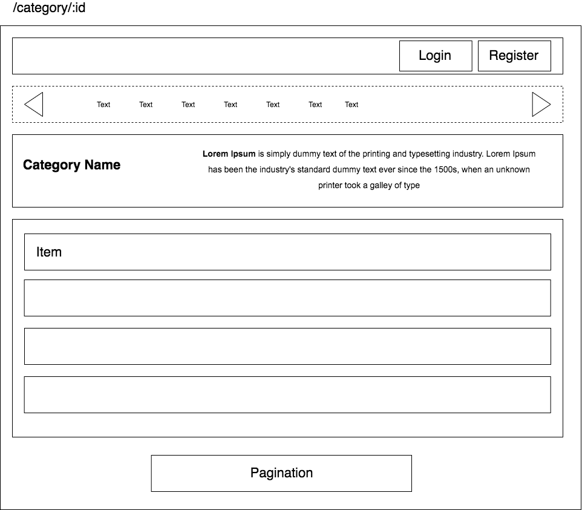

# GOT IT ONBOARDING FINAL PROJECT

## Initial Plan

This project was bootstrapped with [Create React App](https://github.com/facebook/create-react-app).

## Prerequisites
Install NodeJs on your machine

## Install 
1. Clone project
`git clone https://github.com/khuctrang/gotit-training-catalog.git`
2. Install dependencies
`npm install`

## Running Instruction

In the project directory, you can run:

### Development
`npm start`

Runs the app in the development mode. 
Open [http://localhost:3000](http://localhost:3000) to view it in the browser.

You can also run
`REACT_APP_ENV=local npm start` or
`REACT_APP_ENV=staging npm start`
for different environment configuration.

### Testing
`npm test`

Launches the test runner in the interactive watch mode. 

### Production
`REACT_APP_ENV=prod npm run build`

Builds the app for production to the `build` folder. 
It correctly bundles React in production mode and optimizes the build for the best performance.

The build is minified and the filenames include the hashes. 
Your app is ready to be deployed!
